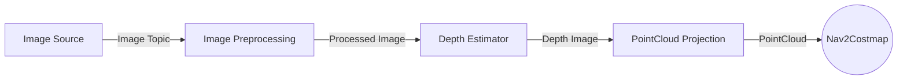

# nav2_depth_estimation_ai

This package provides a **perception pipeline** using AI-based depth estimation using DepthAnything V3 from RGB images for use in navigation and mobility tasks.

The pipeline is designed to be **modular and configurable**, allowing users to swap components such as image sources and depth estimation models using a YAML configuration file.

All components run as **ROS2 composable nodes** inside a single container for efficient intra-process communication.

## Pipeline Architecture



The pipeline performs the following transformations:

1. RGB images are captured from a image source.
2. Optional preprocessing (crop/resize/decimation) is applied.
3. A depth estimation model generates a depth map.
4. The depth map is converted into a **3D point cloud**.

The resulting point cloud can be used by **Nav2 perception pipelines, mapping systems, or obstacle detection modules**.

## Demo

Perception pipeline that generates depth maps and point clouds from RGB input.

https://github.com/user-attachments/assets/12ce2808-099f-4718-b8c1-1de120bb601a

## Dependencies

### Core Dependencies
The following packages are required for the basic pipeline:

- `image_proc` – Used for image preprocessing operations.
- `depth_image_proc` – Used to project depth images into point clouds.

### Example Dependencies
The pipeline can be configured with different nodes. A typical setup may include:

- `usb_cam` as the **RGB image source**
- [depth_anything_v3](https://github.com/ika-rwth-aachen/ros2-depth-anything-v3-trt) as the **depth estimation model**

To build `depth_anything_v3` from source, follow instructions:

```bash
cd ~/ros2_ws/src

git clone https://github.com/ika-rwth-aachen/ros2-depth-anything-v3-trt.git

cd ..

rosdep install --from-paths src --ignore-src -r -y

# From your ROS 2 workspace
colcon build --packages-select depth_anything_v3 --cmake-args -DCMAKE_BUILD_TYPE=Release

source install/setup.bash
```

# Model preparation
1. Obtain the ONNX model (Two Options): 
  A. Download the ONNX file from [Huggingface](https://huggingface.co/TillBeemelmanns/Depth-Anything-V3-ONNX)
  B. Generate ONNX following the instruction [here](https://github.com/ika-rwth-aachen/ros2-depth-anything-v3-trt/blob/main/onnx/README.md)
2. Place model file: Put the ONNX/engine file in the models/ directory
3. Update configuration: Modify config/nav2_depth_ai_params.yaml with the correct model path

```yaml
depth_anything_v3:
  ros__parameters:
    # Model configuration
    onnx_path: "$(find-pkg-share depth_anything_v3)/models/DA3METRIC-LARGE.onnx"
    precision: "fp16"  # fp16 or fp32
```

4. (Optional) Generate TensorRT engine for optimized inference (if using TensorRT backend):

```bash
./src/ros2-depth-anything-v3-trt/generate_engines.sh
```

For the upstream build instructions, see:

https://github.com/ika-rwth-aachen/ros2-depth-anything-v3-trt/tree/main#building

---

### Image Source

Defines the node responsible for providing the **input image stream** to the perception pipeline.

Example configuration:

```yaml
image_source:
  type: rgb
  package: usb_cam
  plugin: usb_cam::UsbCamNode
  parameters:
    video_device: /dev/video0
    image_width: 640
    image_height: 480
    pixel_format: mjpeg2rgb
    frame_rate: 30.0
  topics:
    output_topic: /image_raw
    camera_info_topic: /camera_info
```

---

### Image Preprocessing

Image preprocessing can be enabled to crop, decimate, or resize the image before depth estimation.

```yaml
usb_cam:
  ros__parameters:
    video_device: /dev/video0
    image_width: 640
    image_height: 480
    pixel_format: mjpeg2rgb
    frame_rate: 30.0

crop_decimate:
  ros__parameters:
    x_offset: 0
    y_offset: 0
    width: 640
    height: 480
    decimation_x: 1
    decimation_y: 1

resize:
  ros__parameters:
    width: 504
    height: 280
```

Preprocessing nodes used:

* `image_proc::CropDecimateNode`
* `image_proc::ResizeNode`

However, others may be easily added into the pipeline if necessary.
---

### Depth Estimator

If the input type is **RGB**, a depth estimation model is used to generate a depth image from the incoming RGB frames.

Example configuration:

```yaml
depth_anything_v3:
  ros__parameters:
    # Model configuration
    onnx_path: "$(find-pkg-share depth_anything_v3)/models/DA3METRIC-LARGE.onnx"
    precision: "fp16"  # fp16 or fp32
    
    # Debug configuration
    enable_debug: true
    debug_colormap: "JET"  # JET, HOT, COOL, SPRING, SUMMER, AUTUMN, WINTER, BONE, GRAY, HSV, PARULA, PLASMA, INFERNO, VIRIDIS, MAGMA, CIVIDIS
    debug_filepath: "/tmp/depth_anything_v3_debug/"
    write_colormap: false
    debug_colormap_min_depth: 0.0    # Minimum depth value for colormap visualization
    debug_colormap_max_depth: 50.0   # Maximum depth value for colormap visualization
    sky_threshold: 0.3               # Threshold for sky classification (lower = more sky)
    sky_depth_cap: 200.0             # Maximum depth value to fill sky regions
    
    # Point cloud downsampling (1 = no downsampling, 10 = every 10th point)
    point_cloud_downsample_factor: 2
    
    # Point cloud colorization with RGB from input image
    colorize_point_cloud: true  # Set to true to publish RGB point cloud instead of XYZ only
```

---

## Running the Pipeline

Launch the pipeline:

```bash
ros2 launch nav2_depth_estimation_ai perception_pipeline.launch.py
```

All nodes run inside a **ComposableNodeContainer**.

---

## Output Topics

| Topic                          | Description                        |
| ------------------------------ | ---------------------------------- |
| `/pipeline/image_raw`          | Raw image from camera              |
| `/pipeline/image_preprocessed` | Preprocessed image                 |
| `/pipeline/depth`              | Depth image generated by the model |
| `/pipeline/points`             | Generated 3D point cloud           |


# Nav2 Costmap Integration

The generated point cloud can be integrated into Nav2's costmap layer for obstacle detection and navigation. Below is an example configuration for the local costmap to use the point cloud from the pipeline:

```yaml
local_costmap:
  local_costmap:
    ros__parameters:
      update_frequency: 5.0
      publish_frequency: 2.0
      global_frame: odom
      robot_base_frame: base_link
      rolling_window: true
      width: 3
      height: 3
      resolution: 0.05
      robot_radius: 0.15
      plugins: ["voxel_layer", "inflation_layer"]
      inflation_layer:
        plugin: "nav2_costmap_2d::InflationLayer"
        inflation_radius: 0.5
        cost_scaling_factor: 5.0
      voxel_layer:
        plugin: "nav2_costmap_2d::VoxelLayer"
        enabled: true
        publish_voxel_map: true
        origin_z: 0.0
        z_resolution: 0.05
        z_voxels: 16
        max_obstacle_height: 2.0
        mark_threshold: 0
        observation_sources: pointcloud
        pointcloud:
          topic: /pipeline/points 
          max_obstacle_height: 2.0
          min_obstacle_height: 0.2
          obstacle_max_range: 8.0
          obstacle_min_range: 0.0
          raytrace_max_range: 6.0
          raytrace_min_range: 0.0
          clearing: True
          marking: True
          data_type: "PointCloud2"
```


## Launch files

```bash
# ssh to tb3
ros2 launch turtlebot3_bringup robot.launch.py

# start USB Cam node. Alternatively, you can use any other image source node and update the configuration accordingly.
ros2 run usb_cam usb_cam_node_exe

ros2 launch nav2_depth_estimation_ai perception_pipeline.launch.py use_sim_time:=false

ros2 launch nav2_depth_estimation_ai nav2_bringup.launch.py
```
---

## Troubleshooting

### 1. Depth estimator dependency mismatch

If you are using `depth_anything_v3`, ensure that the dependency versions match those required by the package.

Refer to the official repository for tested dependencies:

https://github.com/ika-rwth-aachen/ros2-depth-anything-v3-trt#dependencies

Version mismatches (e.g., TensorRT, CUDA) may prevent the depth estimator from loading or running correctly.

---

### 2. Point cloud not visualizing

If the pipeline is running and point cloud messages are being published but no data appears in RViz or visualization tools, check the `camera_info` topic.

You can verify it using:

```bash
ros2 topic echo /pipeline/camera_info
```
If the intrinsic camera parameters are all zeros, `depth_image_proc` will not be able to correctly project the depth image into a point cloud.

Ensure that:
- The camera is properly calibrated
- A valid camera_info message is being published

---

## Note to Future Contributors

If any changes are made to the pipeline architecture, configuration structure, or node interfaces, please update the README and documentation accordingly to keep them consistent with the implementation.

