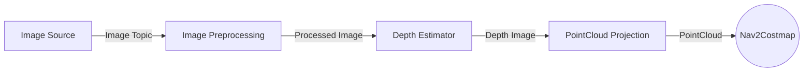

# nav2_depth_estimation_ai

This package provides a **perception pipeline** using AI-based depth estimation using DepthAnything V3 from RGB images for use in navigation and mobility tasks.

The pipeline is designed to be **modular and configurable**, allowing users to swap components such as image sources and depth estimation models using a YAML configuration file.

All components run as **ROS2 composable nodes** inside a single container for efficient intra-process communication.

## Pipeline Architecture



The pipeline performs the following transformations:

1. RGB images are captured from a image source.
2. Optional preprocessing (crop/resize/decimation) is applied.
3. A depth estimation model generates a depth map.
4. The depth map is converted into a **3D point cloud**.

The resulting point cloud can be used by **Nav2 perception pipelines, mapping systems, or obstacle detection modules**.

## Demo

Perception pipeline that generates depth maps and point clouds from RGB input.

https://github.com/user-attachments/assets/12ce2808-099f-4718-b8c1-1de120bb601a

## Dependencies

### Core Dependencies
The following packages are required for the basic pipeline:

- `image_proc` – Used for image preprocessing operations.
- `depth_image_proc` – Used to project depth images into point clouds.

### Example Dependencies
The pipeline can be configured with different nodes. A typical setup may include:

- `usb_cam` as the **RGB image source**
- [depth_anything_v3](https://github.com/ika-rwth-aachen/ros2-depth-anything-v3-trt) as the **depth estimation model**

---

### Image Source

Defines the node responsible for providing the **input image stream** to the perception pipeline.

Example configuration:

```yaml
image_source:
  type: rgb
  package: usb_cam
  plugin: usb_cam::UsbCamNode
  parameters:
    video_device: /dev/video0
    image_width: 640
    image_height: 480
    pixel_format: mjpeg2rgb
    frame_rate: 30.0
  topics:
    output_topic: /image_raw
    camera_info_topic: /camera_info
```

| Parameter                  | Description                                                    |
| -------------------------- | -------------------------------------------------------------- |
| `type`                     | Specifies the input image type used by the pipeline. Supported types: `rgb` or `depth`           |
| `package`                  | ROS 2 package that provides the image source node.             |
| `plugin`                   | Fully qualified composable node plugin used to start the node. |
| `parameters`               | Configuration parameters passed to the image source node.      |
| `topics.output_topic`      | Topic where the node publishes the image stream.               |
| `topics.camera_info_topic` | Topic where the node publishes camera calibration information. |


---

### Image Preprocessing

Image preprocessing can be enabled to crop, decimate, or resize the image before depth estimation.

```yaml
image_preprocessor:
  enabled: true
  parameters:
    resize:
      width: 640
      height: 384
    crop_decimate:
      x_offset: 0
      y_offset: 0
      width: 640
      height: 480
      decimation_x: 1
      decimation_y: 1
```

Preprocessing nodes used:

* `image_proc::CropDecimateNode`
* `image_proc::ResizeNode`

---

### Depth Estimator

If the input type is **RGB**, a depth estimation model is used to generate a depth image from the incoming RGB frames.

Example configuration:

```yaml
depth_estimator:
  enabled: true
  package: depth_anything_v3
  plugin: depth_anything_v3::DepthAnythingV3Node
  model_path: models/DA3METRIC-LARGE.fp16-batch1.engine
  model_path_name_argument: 'onnx_path'
  parameters:
    precision: fp16
  topics:
    input_image: "~/input/image"
    input_camera_info: "~/input/camera_info"
    output_depth: "~/output/depth_image"
```
| Parameter                  | Description                                                                            |
| -------------------------- | -------------------------------------------------------------------------------------- |
| `enabled`                  | Enables or disables the depth estimation stage in the pipeline.                        |
| `package`                  | ROS 2 package that provides the depth estimation node.                                 |
| `plugin`                   | Fully qualified composable node plugin used to start the depth estimation node.        |
| `model_path`               | Path to the model file used for inference.                                             |
| `model_path_name_argument` | Name of the parameter expected by the depth estimation node to receive the model path. |
| `parameters`               | Additional parameters passed to the depth estimation node.                             |
| `topics.input_image`       | Topic used as the input RGB image for the depth estimator.                             |
| `topics.input_camera_info` | Camera calibration information associated with the input image.                        |
| `topics.output_depth`      | Topic where the generated depth image will be published.                               |

---

## Running the Pipeline

Launch the pipeline:

```bash
ros2 launch nav2_depth_estimation_ai perception_pipeline.launch.py
```

All nodes run inside a **ComposableNodeContainer**.

---

## Output Topics

| Topic                          | Description                        |
| ------------------------------ | ---------------------------------- |
| `/pipeline/image_raw`          | Raw image from camera              |
| `/pipeline/image_preprocessed` | Preprocessed image                 |
| `/pipeline/depth`              | Depth image generated by the model |
| `/pipeline/points`             | Generated 3D point cloud           |

---

## Troubleshooting

### 1. Depth estimator dependency mismatch

If you are using `depth_anything_v3`, ensure that the dependency versions match those required by the package.

Refer to the official repository for tested dependencies:

https://github.com/ika-rwth-aachen/ros2-depth-anything-v3-trt#dependencies

Version mismatches (e.g., TensorRT, CUDA) may prevent the depth estimator from loading or running correctly.

---

### 2. Point cloud not visualizing

If the pipeline is running and point cloud messages are being published but no data appears in RViz or visualization tools, check the `camera_info` topic.

You can verify it using:

```bash
ros2 topic echo /pipeline/camera_info
```
If the intrinsic camera parameters are all zeros, `depth_image_proc` will not be able to correctly project the depth image into a point cloud.

Ensure that:
- The camera is properly calibrated
- A valid camera_info message is being published

---

## Note to Future Contributors

If any changes are made to the pipeline architecture, configuration structure, or node interfaces, please update the README and documentation accordingly to keep them consistent with the implementation.

